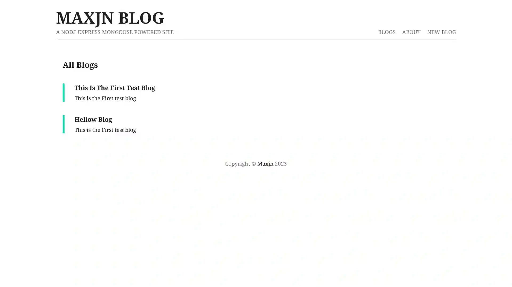

# Node & Express Refresh

These are some Practical **Node** & **Express** projects for refreshing my memory on **Node** & **Express**.

## Technologies

- JS
- Node
- Express

## Features

- Basics
  - globals
  - modules
  - core modules
  - files
  - streams & buffer
- Server
  - Simple server using **http** module
- Express
  - Create a server & Listening to it
  - Redirects
  - 404 & use
- Blog
  - Middleware
  - DB Connection
  - Mongoose ODM
  - Shema & Models
  - Creating URI
  - Quering DB
  - Routing
  - Controller

## Installation
In each folder that needs do each one of these things


###### Blog & Express
Create **blog/.env** & from '.env.example' file in blog directory and declare the project environment variables

```shell
npm install

npm run dev
```

###### Basics & Server

```shell
node { file path }

```

## Installation (Production)

[Deployment Guid](https://dev.to/kunalukey/how-to-setup-and-deploy-a-mern-stack-project-for-free-5acl)


## Screenshots


